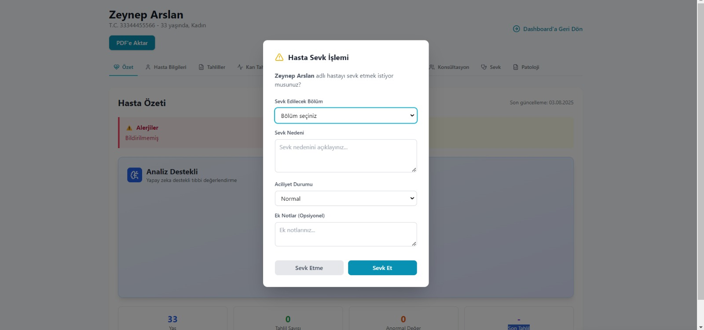

# Shifha

<!-- Shifha gerçek logosu -->
 

## Team Members

| Name                | Title           | Social |
|---------------------|----------------|--------|
| [K. Selim Sarıçiçek](#)         | Scrum Master        |  |
| [Mehmet Pektaş](#)         | Developer        |  |
| [Miyase Elif Aksoy](#)         | Developer     |  |
| [Erva Nazlı Tüccar](#)         | Product Owner       |  |
| [Nurhayat Doğan](#)         | Developer         |  |

## 🎥 Proje Videosu

**Shifha'yı çalışırken görmek için proje sunumumuzu ve demo videomuzu izleyin!**

---

## Product Description

<strong>Türkçe Açıklama</strong>

Günümüzde sağlık hizmetlerinin daha hızlı, doğru ve kişiselleştirilmiş verilere dayalı olması, hem doktorlar hem de hastalar için kritik bir gereklilik haline gelmiştir. Shifha, bu ihtiyaca yönelik geliştirilen, yapay zeka destekli akıllı bir doktor asistanıdır. Web ve mobil platformlar üzerinden çalışan bu sistem, doktorların hastalarıyla ilgili verilere anında ve doğru biçimde ulaşmasını sağlayarak klinik karar alma süreçlerini kolaylaştırır.

Shifha, doktorların iş yükünü azaltırken hastalar için daha hızlı ve etkili bir sağlık süreci sunar. Kan tahlil sonuçlarını analiz eder, anormal değerleri tespit eder ve bu bulgular üzerinden tıbbi önerilerde bulunur. Diyabet gibi kronik hastalıkların erken teşhisi için hasta öyküsü ve tahlil verilerini birleştirerek doktorlara klinik yorumlar sunar. Aynı zamanda hastaların geçmiş sağlık bilgileri sisteme kaydedilerek, birden fazla doktorun bu bilgilere erişebilmesi sağlanır. Doktorlar arasında hasta bazlı iletişim kurulmasına olanak tanıyan dahili mesajlaşma altyapısı da bulunmaktadır.

Shifha ile doktorlar, hastaların yaş, kilo, beslenme alışkanlıkları, ilaç ve aile hastalık geçmişi gibi detaylara ulaşabilir; T.C. kimlik numarasıyla hasta araması yapabilir. Ayrıca yapay zeka destekli tahlil değerlendirmesiyle sistem, her tahlil türüne özel olarak klinik yorumlar ve sağlık önerileri sunar. Mobil uygulama sayesinde tahlil sonuçlarındaki aciliyetlere dair anlık bildirimler alınabilir. Hasta başka bir ülkedeyken bile, tıbbi geçmişine güvenli şekilde ulaşılması için QR kod destekli paylaşım seçeneği mevcuttur.

Sonuç olarak, Shifha, modern sağlık sisteminde doktorların karar alma süreçlerini hızlandırmak ve hasta geçmişini bütünsel bir şekilde yönetmek için geliştirilen güçlü bir çözümdür.

<strong>English Description</strong>

In today's healthcare environment, speed, accuracy, and data-driven decision-making are vital for both medical professionals and patients. Shifha is an AI-powered smart doctor assistant developed to meet this need. Available on both web and mobile platforms, Shifha helps doctors access, interpret, and act upon patient data quickly and effectively, streamlining clinical decision-making.

Shifha simplifies doctors' workflows while offering patients a more efficient and effective care experience. It analyzes blood test results, flags abnormal values, and provides medical suggestions based on those insights. For conditions like diabetes, it combines medical history with test results to generate diagnostic recommendations. Patient history is recorded in the system by the first doctor, and this information can then be accessed by other physicians involved in the patient's care. An internal messaging feature allows doctors to consult each other on patient-specific cases.

With Shifha, doctors can view details such as age, weight, nutrition habits, medication history, and family disease background. Patients can be searched by national ID. AI-driven test analysis offers personalized insights and health advice tailored to each test type. The mobile app provides real-time alerts for critical test results, and a QR-code sharing feature allows patients to securely share their medical history with doctors in other countries.

In summary, Shifha is a powerful assistant designed to enhance decision-making in modern healthcare and provide a seamless, data-driven experience for both doctors and patients.

---

---

## Ürün Özellikleri  

### 🩸 **Akıllı Kan Tahlili Analizi**
- Yapay zeka destekli anormal değer tespiti
- Saniyeler içinde potansiyel risk analizi
- Her tahlil türüne özel klinik yorumlar
- Doktorlara hızlı ön değerlendirme sunumu

### 🩺 **Diyabet Teşhis Desteği**
- Hasta öyküsü ve kan değerlerini birleştiren AI analizi
- Diyabet risk faktörlerinin erken tespiti
- Kapsamlı teşhis önerileri ve klinik yorumlar
- Hasta takip süreçlerinin optimizasyonu

### 📱 **Mobil Uygulama Desteği**
- Anlık tahlil sonucu bildirimleri
- Aciliyet durumlarında anında uyarı sistemi
- Doktorlar arası hızlı iletişim
- Hasta verilerine mobil erişim

### 👥 **Merkezi Hasta Yönetimi**
- T.C. kimlik numarası ile hasta arama
- Kapsamlı hasta profili (yaş, kilo, beslenme alışkanlıkları)
- Aile hastalık geçmişi ve ilaç kullanımı takibi
- Doktor notları ve teşhis geçmişi

### 🔄 **Doktorlar Arası İletişim**
- Hasta bazlı güvenli mesajlaşma sistemi
- Karmaşık vakalar için konsültasyon imkanı
- Hasta verilerinin doktorlar arası paylaşımı
- Sebep-sonuç ilişkili not sistemi

### 🌍 **Uluslararası Veri Paylaşımı**
- QR kod destekli güvenli hasta bilgisi paylaşımı
- Yurtdışı doktorlarla hasta geçmişi paylaşımı
- Şifreli ve güvenli veri transferi
- Hasta onayı ile kontrollü paylaşım

<strong>Product Features (English)</strong>

### 🩸 **Smart Blood Test Analysis**
- AI-powered abnormal value detection
- Potential risk analysis in seconds
- Clinical comments tailored to each test type
- Fast pre-evaluation for doctors

### 🩺 **Diabetes Diagnosis Support**
- AI analysis combining patient history and blood values
- Early detection of diabetes risk factors
- Comprehensive diagnostic suggestions and clinical comments
- Optimized patient follow-up processes

### 📱 **Mobile App Support**
- Instant test result notifications
- Immediate alert system for urgent cases
- Fast communication between doctors
- Mobile access to patient data

### 👥 **Centralized Patient Management**
- Patient search by national ID
- Comprehensive patient profile (age, weight, nutrition habits)
- Family disease history and medication tracking
- Doctor notes and diagnosis history

### 🔄 **Doctor-to-Doctor Communication**
- Patient-based secure messaging system
- Consultation for complex cases
- Patient data sharing between doctors
- Cause-effect related note system

### 🌍 **International Data Sharing**
- Secure patient information sharing with QR code support
- Sharing patient history with doctors abroad
- Encrypted and secure data transfer
- Controlled sharing with patient consent

---

## Hedef Kitle  

### 👨‍⚕️ **Doktorlar ve Sağlık Profesyonelleri**
- Pratisyen hekimler ve uzmanlar
- Laboratuvar doktorları ve teknisyenleri
- Acil servis ve yoğun bakım doktorları
- Aile hekimleri ve poliklinik doktorları

### 🏥 **Sağlık Kurumları**
- Hastaneler ve tıp merkezleri
- Özel klinikler ve muayenehaneler
- Laboratuvar ve görüntüleme merkezleri
- Sağlık Bakanlığı ve il sağlık müdürlükleri

### 👥 **Hastalar**
- Kronik hastalık takibi gereken hastalar
- Birden fazla doktora başvuran hastalar
- Yurtdışı seyahat eden hastalar
- Detaylı sağlık geçmişi takibi isteyen hastalar

<strong>Target Audience (English)</strong>

### 👨‍⚕️ **Doctors and Healthcare Professionals**
- General practitioners and specialists
- Laboratory doctors and technicians
- Emergency and intensive care doctors
- Family physicians and outpatient doctors

### 🏥 **Healthcare Institutions**
- Hospitals and medical centers
- Private clinics and practices
- Laboratory and imaging centers
- Ministry of Health and provincial health directorates

### 👥 **Patients**
- Patients requiring chronic disease monitoring
- Patients consulting multiple doctors
- Patients traveling abroad
- Patients seeking detailed health history tracking

---

## Teknoloji Tercihleri  

### 🎨 **Frontend**
- **React.js** - Modern web uygulaması geliştirme
- **Tailwind CSS** - Responsive ve modern UI tasarımı
- **Lucide React** - İkon kütüphanesi
- **Context API** - State yönetimi

### ⚙️ **Backend**
- **Node.js** - Server-side JavaScript runtime
- **Express.js** - Web framework
- **Prisma ORM** - Database management
- **PostgreSQL** - Relational database
- **JWT** - Authentication

### 🤖 **AI & Services**
- **Google Gemini AI** - Kan tahlili analizi
- **Supabase** - Cloud database ve authentication
- **PDF Parser** - Tahlil sonuçlarını otomatik okuma

<strong>Technology Stack (English)</strong>

### 🎨 **Frontend**
- **React.js** - Modern web application development
- **Tailwind CSS** - Responsive and modern UI design
- **Lucide React** - Icon library
- **Context API** - State management

### ⚙️ **Backend**
- **Node.js** - Server-side JavaScript runtime
- **Express.js** - Web framework
- **Prisma ORM** - Database management
- **PostgreSQL** - Relational database
- **JWT** - Authentication

### 🤖 **AI & Services**
- **Google Gemini AI** - Blood test analysis
- **Supabase** - Cloud database and authentication
- **PDF Parser** - Automatic lab result reading

---

## Sprints

  
<h1>Sprint 1</h1>

---

  
<h2>App Screenshots</h2>

### Landing Page

---
### Login Page

---
### Dashboard Page

---
### Patient Page

---
### AI Assistant Page

---

---

  
<h2>Project Management</h2>

### Jira Board 1

---
### Jira Board 2

---
### Jira Board 3

---
### Jira Board 4

---
### Jira Board 5

---
### Jira Board 6

---
### Jira Board 7

---
### Jira Board 8

---
### Jira Board 9

---

  
<h2>Burndown Chart S1</h2>

### Burndown Chart 1

---
### Burndown Graph 2

---

  
<h2>Daily Scrum</h2>

### 1. Gün
|  |  |  |
|--|--|--|
|  |  |  |

### 2. Gün
|  |  |  |
|--|--|--|
|  |  |  |
|  |  |  |

### 3. Gün
|  |  |  |
|--|--|--|
|  |  |  |
|  |  |  |

### 4. Gün
|  |  |  |
|--|--|--|
|  |  |  |

### 5. Gün
|  |  |  |
|--|--|--|
|  |  |  |

### 6. Gün
|  |  |  |
|--|--|--|
|  |  |  |
|  |  |  |

### 7. Gün
|  |  |  |
|--|--|--|
|  |  |  |

### 8. Gün
|  |  |  |
|--|--|--|
|  |  |  |
|  |  |  |

### 9. Gün
|  |  |  |
|--|--|--|
|  |  |  |
|  |  |  |

### 10. Gün
|  |  |  |
|--|--|--|
|  |  |  |

### 11. Gün
|  |  |  |
|--|--|--|
|  |  |  |
|  |  |  |
|  |  |  |

### 12. Gün
|  |  |  |
|--|--|--|
|  |  |  |

<strong>🟦 Sprint 1 Özeti (Türkçe)</strong>

### Sprint Notları
- [x] _'Figma'_ ile UI/UX tasarımı
- [x] _'Jira'_ ile proje yönetimi
- [x] _'WhatsApp'_ & _'Google Meets'_ ile daily scrum
- [x] _'E-mail'_ tabanlı giriş sistemi
- [x] _'React'_ ile frontend web uygulaması
- [x] _'Tailwind CSS'_ ile modern, responsive UI
- [x] _'Node.js'_ ve _'Express.js'_ ile backend API
- [x] _'Prisma ORM'_ ile veritabanı yönetimi
- [x] _'PostgreSQL'_ ana ilişkisel veritabanı olarak
- [x] _'JWT'_ ile güvenli kimlik doğrulama
- [x] _'Supabase'_ ile bulut depolama ve kimlik doğrulama
- [x] _'Lucide React'_ ile ikon kullanımı
- [x] _'Context API'_ ile React'ta state yönetimi
- [x] _'PDF parser'_ ile otomatik laboratuvar sonucu çıkarımı
- [x] _'Google Gemini AI'_ ile kan tahlili ve diyabet analizi

### Ürün Backlog'u
- **Ürün Backlog'u:** [Jira Board Linki](https://selimsaricicek1.atlassian.net/jira/software/projects/BTS/boards/1)

### Beklenen Puan
_'300'_ Puan

### Puan Tamamlama Mantığı
Toplamda 1200 puanlık bir hedef belirlendi. İlk sprintte, fikir planlandığı ve tasarımlar yapıldığı için _'300'_ puan hedeflendi ve tamamlandı. İkinci sprintte, kod yazımı ve API eklemeye odaklanılacağı için _'500'_ puan hedefleniyor. Üçüncü sprintte ise kalan işler tamamlanacak ve entegrasyon çalışmaları yapılacağı için _'400'_ puan hedeflendi.

### Sprint Değerlendirmesi
- Landing page ve UI tasarımları tamamlandı
- Hasta veri formu ve PDF yükleme özellikleri eklendi
- Backend API altyapısı kuruldu
- Prisma ile veritabanı şeması oluşturuldu

### Sprint 1 Retrospektifi
- Sprint 1'de veritabanı şeması tasarlanmasına karar verildi.
- Temel API uç noktalarının oluşturulmasına karar verildi.
- Kimlik doğrulama sisteminin ilk adımının tamamlanmasına karar verildi.
- Landing Page ve Login Page'in geliştirilmesine karar verildi.
- Doktor arayüzünün geliştirilmesine karar verildi.
- Kan tahlili ve diyabet teşhisi için AI promptlarının oluşturulmasına karar verildi.
- Kanser teşhisi ve admin paneli özelliklerinin ertelenmesine karar verildi.
- Kan tahlili sonuçları ve diyabet bulguları üzerine araştırma yapılmasına karar verildi.

### Katılımcılar
Kenan Selim Sarıçiçek, Mehmet Pektaş, Miyase Elif Aksoy, Erva Nazlı Tüccar, Nurhayat Doğan

<strong>🟩 Sprint 1 Summary (English)</strong>

### Sprint Notes
- [x] UI/UX design with _'Figma'_
- [x] Project management with _'Jira'_
- [x] Daily scrum via _'WhatsApp'_ & _'Google Meets'_
- [x] E-mail based login system
- [x] Frontend web application with _'React'_
- [x] Modern, responsive UI with _'Tailwind CSS'_
- [x] Backend API with _'Node.js'_ and _'Express.js'_
- [x] Database management with _'Prisma ORM'_
- [x] _'PostgreSQL'_ as the main relational database
- [x] Secure authentication with _'JWT'_
- [x] Cloud storage and authentication with _'Supabase'_
- [x] Iconography with _'Lucide React'_
- [x] State management in React with _'Context API'_
- [x] Automatic lab result extraction with _'PDF parser'_ service
- [x] Blood test and diabetes analysis with _'Google Gemini AI'_

### Product Backlog
- **Product Backlog:** [Jira Board Link](https://selimsaricicek1.atlassian.net/jira/software/projects/BTS/boards/1)

### Expected Points
_'300'_ Points

### Point Completion Logic
A total target of 1200 points was set. In the first sprint, _'300'_ points were targeted because the idea was planned and the designs were made, and were completed. In the second sprint, _'500'_ points are targeted as the focus will be on writing code and adding APIs. In the third sprint, a target of _'400'_ points was set as the remaining tasks would be completed and integration work would be carried out.

### Sprint Review
- Landing page and UI designs completed
- Patient data form and PDF upload features added
- Backend API infrastructure established
- Database schema created with Prisma

### Sprint 1 Retrospective
- It was decided to design the database schema in Sprint 1.
- It was decided to create the basic API Endpoints.
- It was decided to complete the first step of the authentication system.
- It was decided to develop the Landing Page and Login Page.
- It was decided to develop the Doctor UI.
- It was decided to create the AI prompts for blood tests and diabetes diagnosis.
- It was decided to postpone the cancer diagnosis and admin panel features.
- It was decided to conduct research on blood test results and diabetes findings.

### Participants
Kenan Selim Sarıçiçek, Mehmet Pektaş, Miyase Elif Aksoy, Erva Nazlı Tüccar, Nurhayat Doğan

---

---

  
<h1>Sprint 2</h1>

---

  
<h2>Mobile App Screenshots</h2>

### Hasta Mobil Uygulaması

---
### Mobil Register ve Login

---
### Doktor Paneli

---

  
<h2>Admin Panel Screenshots</h2>

### Admin Paneli

---

  
<h2>Project Management S2</h2>

### Jira Board 1

---
### Jira Board 2

---
### Jira Board 3

---
### Jira Board 4

---
### Jira Board 5

---
### Jira Board 6

---
### Jira Board 7

---
### Jira Board 8

---
### Jira Board 9

---
### Jira Board 10

---

  
<h2>Burndown Chart S2</h2>

### Burndown Chart 2

---
### Burndown Graph 2

---

  
<h2>Daily Scrum S2</h2>

### 07.07.2025
|  |  |  |
|--|--|--|
|  |  |  |

### 08.07.2025
|  |  |  |
|--|--|--|
|  |  |  |

### 09.07.2025
|  |  |  |
|--|--|--|
|  |  |  |

### 10.07.2025
|  |  |  |
|--|--|--|
|  |  |  |
|  |  |  |
|  |  |  |

### 11.07.2025
|  |  |  |
|--|--|--|
|  |  |  |

### 12.07.2025
|  |  |  |
|--|--|--|
|  |  |  |
|  |  |  |

### 13.07.2025
|  |  |  |
|--|--|--|
|  |  |  |
|  |  |  |
|  |  |  |

### 14.07.2025
|  |  |  |
|--|--|--|
|  |  |  |
|  |  |  |

### 15.07.2025
|  |  |  |
|--|--|--|
|  |  |  |

### 16.07.2025
|  |  |  |
|--|--|--|
|  |  |  |
|  |  |  |

### 17.07.2025
|  |  |  |
|--|--|--|
|  |  |  |

### 18.07.2025
|  |  |  |
|--|--|--|
|  |  |  |

### 19.07.2025
|  |  |  |
|--|--|--|
|  |  |  |
|  |  |  |
|  |  |  |

<strong>🟦 Sprint 2 Özeti (Türkçe)</strong>

### Sprint Notları
- [x] _'React Native'_ ile mobil uygulama geliştirme
- [x] _'Expo'_ framework kullanımı
- [x] _'Expo Router'_ ile navigation sistemi
- [x] _'QR Kod'_ tarama özelliği
- [x] _'WebSocket'_ ile real-time iletişim
- [x] _'Redis'_ ile session yönetimi
- [x] _'Socket.io'_ ile backend WebSocket sunucusu
- [x] _'Mobil UI/UX'_ tasarımı ve implementasyonu
- [x] _'Hasta Paneli'_ ve _'Doktor Paneli'_ ayrımı
- [x] _'Bildirim Sistemi'_ implementasyonu
- [x] _'Güvenli API'_ entegrasyonu
- [x] _'Cross-platform'_ mobil uygulama geliştirme

### Ürün Backlog'u
- **Ürün Backlog'u:** [Jira Board Linki](https://selimsaricicek1.atlassian.net/jira/software/projects/BTS/boards/1)

### Beklenen Puan
_'500'_ Puan

### Puan Tamamlama Mantığı
Sprint 2'de mobil uygulama geliştirme ve API entegrasyonuna odaklanıldığı için _'500'_ puan hedeflendi. Bu sprintte React Native ile cross-platform mobil uygulama, QR kod tarama, WebSocket iletişimi ve güvenli API entegrasyonu tamamlandı.

### Sprint Değerlendirmesi
- React Native mobil uygulama geliştirildi
- Expo Router ile navigation sistemi kuruldu
- QR kod tarama ve manuel giriş özellikleri eklendi
- WebSocket ile real-time iletişim altyapısı kuruldu
- Redis ile session yönetimi implementasyonu yapıldı
- Hasta ve doktor panelleri ayrı ayrı tasarlandı
- Mobil UI/UX tasarımı tamamlandı
- Güvenli API entegrasyonu sağlandı

### Sprint 2 Retrospektifi
- Mobil uygulama geliştirme sürecinde Expo Router kullanımına karar verildi
- QR kod tarama özelliği için hem kamera hem manuel giriş seçenekleri eklendi
- WebSocket ile real-time iletişim için backend altyapısı kuruldu
- Redis ile session yönetimi için güvenli sistem tasarlandı
- Hasta ve doktor panelleri için ayrı UI/UX tasarımları yapıldı
- Cross-platform geliştirme için React Native tercih edildi
- Mobil uygulama test süreçleri planlandı
- API güvenliği ve authentication sistemi güçlendirildi

### Katılımcılar
Kenan Selim Sarıçiçek, Mehmet Pektaş, Miyase Elif Aksoy, Erva Nazlı Tüccar, Nurhayat Doğan

<strong>🟩 Sprint 2 Summary (English)</strong>

### Sprint Notes
- [x] Mobile application development with _'React Native'_
- [x] _'Expo'_ framework usage
- [x] Navigation system with _'Expo Router'_
- [x] _'QR Code'_ scanning feature
- [x] Real-time communication with _'WebSocket'_
- [x] Session management with _'Redis'_
- [x] Backend WebSocket server with _'Socket.io'_
- [x] Mobile UI/UX design and implementation
- [x] _'Patient Panel'_ and _'Doctor Panel'_ separation
- [x] _'Notification System'_ implementation
- [x] _'Secure API'_ integration
- [x] _'Cross-platform'_ mobile application development

### Product Backlog
- **Product Backlog:** [Jira Board Link](https://selimsaricicek1.atlassian.net/jira/software/projects/BTS/boards/1)

### Expected Points
_'500'_ Points

### Point Completion Logic
In Sprint 2, _'500'_ points were targeted as the focus was on mobile application development and API integration. This sprint completed React Native cross-platform mobile app, QR code scanning, WebSocket communication, and secure API integration.

### Sprint Review
- React Native mobile application developed
- Navigation system established with Expo Router
- QR code scanning and manual input features added
- Real-time communication infrastructure established with WebSocket
- Session management implementation with Redis
- Patient and doctor panels designed separately
- Mobile UI/UX design completed
- Secure API integration achieved

### Sprint 2 Retrospective
- It was decided to use Expo Router in the mobile application development process
- Both camera and manual input options were added for QR code scanning feature
- Backend infrastructure was established for real-time communication with WebSocket
- Secure system was designed for session management with Redis
- Separate UI/UX designs were made for patient and doctor panels
- React Native was preferred for cross-platform development
- Mobile application testing processes were planned
- API security and authentication system were strengthened

### Participants
Kenan Selim Sarıçiçek, Mehmet Pektaş, Miyase Elif Aksoy, Erva Nazlı Tüccar, Nurhayat Doğan

---

---

  
<h1>Sprint 3</h1>

---

### Tech Tree - Sprint 3

#### Frontend (Web)
- **React 18** - Modern React with concurrent features
- **TypeScript** - Type-safe development
- **Vite** - Fast build tool and dev server
- **shadcn/ui** - Modern UI component library
- **Tailwind CSS** - Utility-first CSS framework
- **React Query** - Server state management
- **React Hook Form** - Form management
- **Zod** - Schema validation

#### Backend
- **Node.js** - JavaScript runtime
- **Express.js** - Web framework
- **Socket.io** - Real-time communication
- **Helmet.js** - Security middleware
- **MongoDB** - NoSQL database
- **Redis** - Caching and session store

#### Mobile
- **Capacitor** - Cross-platform mobile development
- **React** - UI framework
- **TypeScript** - Type safety

#### AI & Cloud Services
- **Google Gemini AI** - Advanced AI analysis
- **Google Cloud** - Cloud infrastructure

#### Development Tools
- **Vite** - Build tool
- **ESLint** - Code linting
- **Prettier** - Code formatting

#### Security
- **Helmet.js** - Security headers
- **CORS** - Cross-origin resource sharing
- **Rate Limiting** - API protection

---

### Sprint 3 Technology Evolution

#### New Additions in Sprint 3
- **Capacitor**: Cross-platform mobile development framework
- **React Query**: Advanced server state management
- **shadcn/ui**: Modern, accessible UI components
- **Vite**: Fast build tool replacing Create React App
- **Helmet.js**: Enhanced security middleware
- **Recharts**: Data visualization library
- **jsPDF**: PDF generation capability
- **Zod**: Runtime type validation
- **React Hook Form**: Efficient form management

#### Enhanced Features
- **Socket.io**: Improved real-time communication
- **Google Gemini AI**: Advanced analysis capabilities
- **QR Code**: International data sharing
- **Security**: Multi-layer protection with Helmet.js

---

  
<h2>App Map</h2>

### Shifha Application Architecture Map
[View Interactive App Map](https://viewer.diagrams.net/index.html?tags=%7B%7D&lightbox=1&highlight=99FFFF&layers=1&nav=1&title=ShifhaAppMap.drawio&dark=auto#Uhttps%3A%2F%2Fdrive.google.com%2Fuc%3Fid%3D1cioWUCyPWPY1tWFCgLK_tOLGnaN9Ozzz%26export%3Ddownload#%7B%22pageId%22%3A%22KyPbk5wrGZAwVsf7y1UN%22%7D)

*Interactive application architecture diagram showing the complete structure and flow of the Shifha application for Sprint 3.*

---

  
<h2>App Screenshots S3</h2>

|  |  |  |
|--|--|--|
|  |  |  |
|  |  |  |
|  |  |  |
|  |  |  |
|  |  |  |
|  |  |  |

---

  
<h2>Mobil App Screenshots S3</h2>

### Hasta Uygulaması

**Ana Sayfa:**
| | | |
|--|--|--|
|  |  |  |

**Giriş Sayfası:**
| |
|--|
|  |

**Topluluk Sayfası:**
| | |
|--|--|
|  |  |

**Takip Sayfası:**
| | | |
|--|--|--|
|  |  |  |
|  |  | |

**Tahlil Sayfası:**
| | |
|--|--|
|  |  |

**Randevu Sayfası:**
| | | |
|--|--|--|
|  |  |  |
|  |  |  |
|  |  |  |

**Profil Sayfası:**
| | | |
|--|--|--|
|  |  |  |

**AI Sayfası:**
| |
|--|
|  |

### Doktor Uygulaması

**Ana Sayfa:**
| | | |
|--|--|--|
|  |  |  |
|  | | |

**Giriş Sayfası:**
| | | |
|--|--|--|
|  |  |  |

**Hastalar Sayfası:**
| |
|--|
|  |

**Profil Sayfası:**
| | | |
|--|--|--|
|  |  |  |

**Randevular Sayfası:**
| |
|--|
|  |

---

  
<h2>Admin Panel Screenshots S3</h2>

### Admin Paneli S3

---

  
<h2>Project Management S3</h2>

### Jira Board 1

---
### Jira Board 2

---
### Jira Board 3

---
### Jira Board 4

---
### Jira Board 5

---
### Jira Board 6

---
### Jira Board 7

---
### Jira Board 8

---
### Jira Board 9

---
### Jira Board 10

---

  
<h2>Lean Canva S3</h2>

---

  
<h2>Burndown Chart S3</h2>

- **Burndown Chart:**

  

- **Burndown Graph:**

  

---

  
<h2>Daily Scrum S3</h2>

### 1. Gün
|  |  |  |
|--|--|--|
|  |  |  |

### 2. Gün
|  |  |  |
|--|--|--|
|  |  |  |
|  |  |  |

### 3. Gün
|  |  |  |
|--|--|--|
|  |  |  |
|  |  |  |

### 4. Gün
|  |  |  |
|--|--|--|
|  |  |  |

### 5. Gün
|  |  |  |
|--|--|--|
|  |  |  |
|  |  |  |

### 6. Gün
|  |  |  |
|--|--|--|
|  |  |  |

### 7. Gün
|  |  |  |
|--|--|--|
|  |  |  |
|  |  |  |

### 8. Gün
|  |  |  |
|--|--|--|
|  |  |  |
|  |  |  |

### 9. Gün
|  |  |  |
|--|--|--|
|  |  |  |

### 10. Gün
|  |  |  |
|--|--|--|
|  |  |  |
|  |  |  |

### 11. Gün
|  |  |  |
|--|--|--|
|  |  |  |

### 12. Gün
|  |  |  |
|--|--|--|
|  |  |  |
|  |  |  |

### 13. Gün
|  |  |  |
|--|--|--|
|  |  |  |
|  |  |  |

### 14. Gün
|  |  |  |
|--|--|--|
|  |  |  |
|  |  |  |

---

<strong>🟦 Sprint 3 Özeti (Türkçe)</strong>

### Sprint Notları
- [x] _'Capacitor'_ ile cross-platform mobil uygulama geliştirme
- [x] _'React Query'_ ile gelişmiş veri yönetimi
- [x] _'shadcn/ui'_ ile modern UI bileşenleri
- [x] _'Vite'_ ile hızlı build ve geliştirme
- [x] _'Socket.io'_ ile real-time iletişim geliştirmeleri
- [x] _'Recharts'_ ile gelişmiş veri görselleştirme
- [x] _'jsPDF'_ ile PDF oluşturma ve raporlama
- [x] _'Helmet.js'_ ile güvenlik iyileştirmeleri
- [x] _'QR Kod'_ ile uluslararası veri paylaşımı
- [x] _'Google Gemini AI'_ ile gelişmiş analiz
- [x] _'Zod'_ ile form validasyonu
- [x] _'React Hook Form'_ ile form yönetimi

### Ürün Backlog'u
- **Ürün Backlog'u:** [Jira Board Linki](https://selimsaricicek1.atlassian.net/jira/software/projects/BTS/boards/1)

### Beklenen Puan
_'400'_ Puan

### Puan Tamamlama Mantığı
Sprint 3'te kalan işlerin tamamlanması ve entegrasyon çalışmalarına odaklanıldığı için _'400'_ puan hedeflendi. Bu sprintte Capacitor ile cross-platform geliştirme, gelişmiş UI bileşenleri, güvenlik iyileştirmeleri ve AI analiz sisteminin optimize edilmesi tamamlandı.

### Sprint Değerlendirmesi
- Capacitor framework ile cross-platform mobil uygulama geliştirildi
- React Query ile gelişmiş veri yönetimi implementasyonu yapıldı
- shadcn/ui ile modern ve tutarlı UI bileşenleri eklendi
- Vite ile build süreçleri optimize edildi
- Socket.io ile real-time iletişim sistemi geliştirildi
- Recharts ile gelişmiş veri görselleştirme eklendi
- jsPDF ile PDF oluşturma ve raporlama sistemi kuruldu
- Helmet.js ile güvenlik iyileştirmeleri yapıldı
- QR kod ile uluslararası veri paylaşımı implementasyonu tamamlandı
- Google Gemini AI ile gelişmiş analiz sistemi optimize edildi
- Zod ve React Hook Form ile form yönetimi geliştirildi

### Sprint 3 Retrospektifi
- Capacitor framework kullanımı ile cross-platform geliştirme sürecinde verimlilik artışı sağlandı
- React Query ile veri yönetimi ve caching sisteminde önemli iyileştirmeler yapıldı
- shadcn/ui bileşenleri ile UI tutarlılığı ve kullanıcı deneyimi geliştirildi
- Vite build tool kullanımı ile geliştirme süreçleri hızlandırıldı
- Real-time iletişim sistemi Socket.io ile optimize edildi
- PDF oluşturma ve raporlama sistemi jsPDF ile başarıyla implementasyonu yapıldı
- Güvenlik katmanları Helmet.js ile güçlendirildi
- QR kod sistemi ile uluslararası veri paylaşımı güvenli hale getirildi
- AI analiz sistemi Google Gemini ile daha doğru sonuçlar üretecek şekilde optimize edildi
- Form validasyonu ve yönetimi Zod ve React Hook Form ile profesyonel seviyeye çıkarıldı

### Katılımcılar
Kenan Selim Sarıçiçek, Mehmet Pektaş, Miyase Elif Aksoy, Erva Nazlı Tüccar, Nurhayat Doğan

<strong>🟩 Sprint 3 Summary (English)</strong>

### Sprint Notes
- [x] Cross-platform mobile application development with _'Capacitor'_
- [x] Advanced data management with _'React Query'_
- [x] Modern UI components with _'shadcn/ui'_
- [x] Fast build and development with _'Vite'_
- [x] Real-time communication improvements with _'Socket.io'_
- [x] Advanced data visualization with _'Recharts'_
- [x] PDF creation and reporting with _'jsPDF'_
- [x] Security improvements with _'Helmet.js'_
- [x] International data sharing with _'QR Code'_
- [x] Advanced analysis with _'Google Gemini AI'_
- [x] Form validation with _'Zod'_
- [x] Form management with _'React Hook Form'_

### Product Backlog
- **Product Backlog:** [Jira Board Link](https://selimsaricicek1.atlassian.net/jira/software/projects/BTS/boards/1)

### Expected Points
_'400'_ Points

### Point Completion Logic
In Sprint 3, _'400'_ points were targeted as the focus was on completing remaining tasks and integration work. This sprint completed Capacitor cross-platform development, advanced UI components, security improvements, and AI analysis system optimization.

### Sprint Review
- Cross-platform mobile application developed with Capacitor framework
- Advanced data management implementation with React Query
- Modern and consistent UI components added with shadcn/ui
- Build processes optimized with Vite
- Real-time communication system enhanced with Socket.io
- Advanced data visualization added with Recharts
- PDF creation and reporting system established with jsPDF
- Security improvements made with Helmet.js
- International data sharing implementation completed with QR code
- Advanced analysis system optimized with Google Gemini AI
- Form management enhanced with Zod and React Hook Form

### Sprint 3 Retrospective
- Efficiency increase achieved in cross-platform development process with Capacitor framework usage
- Significant improvements made in data management and caching system with React Query
- UI consistency and user experience improved with shadcn/ui components
- Development processes accelerated with Vite build tool usage
- Real-time communication system optimized with Socket.io
- PDF creation and reporting system successfully implemented with jsPDF
- Security layers strengthened with Helmet.js
- International data sharing made secure with QR code system
- AI analysis system optimized with Google Gemini to produce more accurate results
- Form validation and management elevated to professional level with Zod and React Hook Form
- It was decided to use Expo Router in the mobile application development process
- Both camera and manual input options were added for QR code scanning feature
- Backend infrastructure was established for real-time communication with WebSocket
- Secure system was designed for session management with Redis
- Separate UI/UX designs were made for patient and doctor panels
- React Native was preferred for cross-platform development
- Mobile application testing processes were planned
- API security and authentication system were strengthened

### Participants
Kenan Selim Sarıçiçek, Mehmet Pektaş, Miyase Elif Aksoy, Erva Nazlı Tüccar, Nurhayat Doğan

---

---

---

# 📋 Endnotes

**Contributions are welcome!**

---